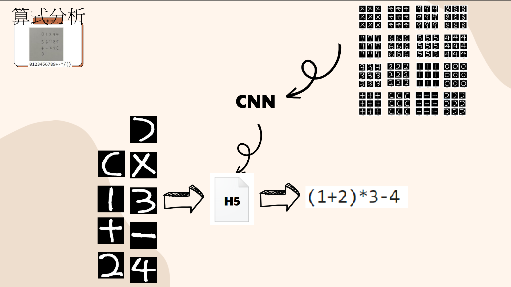

# Python_programming
Python程式設計_專題_手寫算式圖形辨識
主要功能為可以用手機拍攝一條簡單的四則運算的算式，傳送給Line聊天機器人。
Line聊天機器人會將圖片傳送到後端。
後端會先將圖片中的算式切割出來，再將所有的運算子以及運算元切割出來。
切割出來的運算子與運算元會傳送到圖形識別的模型中分析。
根據分析出的結果計算出答案後再藉由LineBot傳回

## 說明
    

詳細內容請參見Group5.pdf